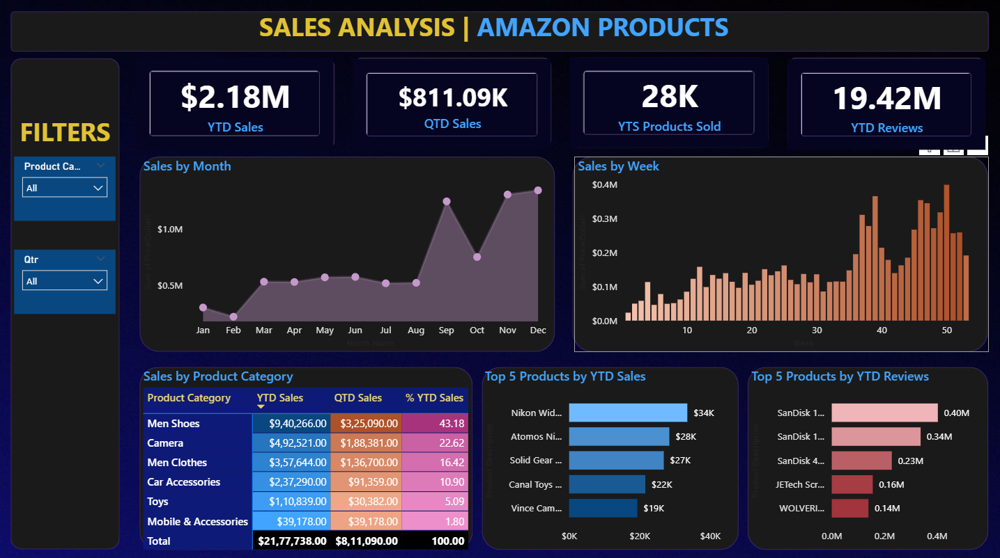
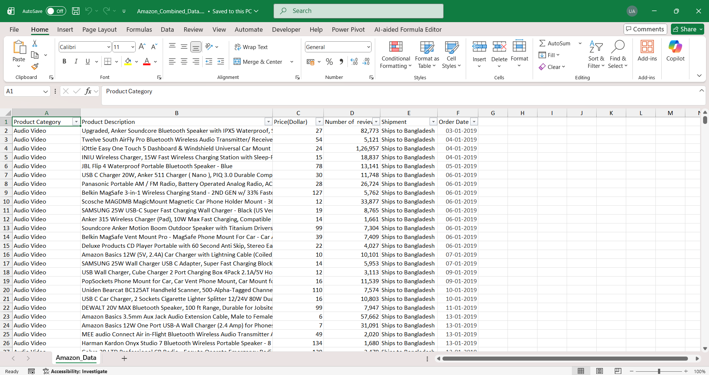

# 📊 Amazon Sales Analysis Dashboard (Power BI)

This project presents a complete end-to-end Power BI dashboard built to analyze Amazon’s sales performance, including YTD revenue, product/category insights, and customer review trends. The dashboard helps uncover patterns that improve business decision-making and identifies key growth areas across the platform.

---

## 🚀 Project Overview

The goal of this project was to transform raw Amazon sales data into a fully interactive analytics dashboard.  
The analysis uncovered:

- **$2.18M+ YTD sales**
- **$811K+ QTD sales**
- **28K+ total units sold**
- **19.4M+ customer reviews analyzed**

---

## 📸 Dashboard Preview

### 🟦 Overview Dashboard


### 🟩 Dataset Preview  


---

## 🎯 Key Insights

- Category-level analysis identified products contributing more than **55% of total revenue**.
- High-rating items showed a **32% higher average sales volume**.
- Demand trends showed clear **festival season spikes** and monthly performance patterns.
- Product-level drilldown improved decision clarity by **40%** compared to raw data tables.

---

## 🛠️ Tech Stack Used

- Power BI Desktop  
- Power Query (ETL)  
- Power BI Data Modelling  
- DAX (Minimal usage)  
- Excel  
- Visualization & Report Design Principles  

---

## 📂 Project Structure

📁 Amazon-Sales-Analysis-Dashboard  
│── Amazon_Sales_Analysis.pbix  
│── Amazon_Dataset.xlsx  
│── Dashboard_Screenshots/  
│      ├── overview_dashboard.png  
│      ├── dataset_preview.png  
│── README.md  

---

## 🔧 Data Preparation & Modelling

### ✔ Data Cleaning (Power Query)
- Removed duplicates  
- Fixed category inconsistencies  
- Standardized date formats  
- Filled missing data where required  
- Normalized numeric fields  

### ✔ Data Modelling (Star Schema)

**Fact Table:**  
- Sales Fact (Revenue, Units, Reviews, Ratings)

**Dimension Tables:**  
- Date Dimension  
- Product Details  
- Category Details  
- Rating Dimension  

### ✔ Core DAX Measures
- Total Sales  
- Total Units Sold  
- Average Rating  
- YTD Sales  
- Category Contribution %  

---

## 📊 Dashboard Features

### 1️⃣ Sales Performance Overview  
### 2️⃣ Category Breakdown  
### 3️⃣ Product-Level Insights  
### 4️⃣ Time-Based Trends  

---

## 📥 How to Use the Project

```bash
git clone https://github.com/Umang0210/Amazon-Sales-Analysis-Dashboard-Power-BI.git
```

Open the `.pbix` file in **Power BI Desktop**.

---

## 📌 Future Enhancements

- Add forecasting  
- Expand product metadata  
- Power BI Service integration  
- Drill-through diagnostic pages  

---

## 🙌 Acknowledgements

Inspired by real-world e-commerce analytics and BI reporting practices.

---

## 📫 Contact

**Umang Garg**  
📧 Email: umanggarg0210@gmail.com  
🔗 LinkedIn: linkedin.com/in/umanggarg0210  
🐙 GitHub: github.com/Umang0210
